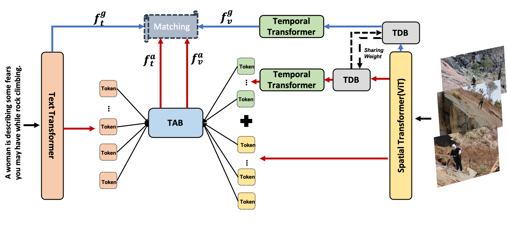
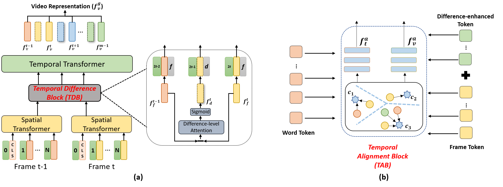

# CLIP2Video: Mastering Video-Text Retrieval via Image CLIP

The implementation of paper [**CLIP2Video: Mastering Video-Text Retrieval via Image CLIP**](https://arxiv.org/abs/2106.11097). 

CLIP2Video is a video-text retrieval model based on [CLIP (ViT-B/32)](https://github.com/openai/CLIP), which transfers the image-language pre-training model to video-text retrieval in an end-to-end manner. Our model involves a Temporal Difference Block to capture motions at fine temporal video frames, and a Temporal Alignment Block to re-align the tokens of video clips and phrases and enhance the multi-modal correlation. We conduct thorough ablation studies, and achieve state-of-the-art performance on major text-to-video and video-to-text retrieval benchmarks, including new records of retrieval accuracy on MSR-VTT, MSVD and VATEX.





## Introduction
This is the source code of CLIP2Video, 
a method for Video-Text Retrieval based on temporal correlations. 
It is built on top of the CLIP4Clip by ([ Huaishao Luo *et al.*](https://github.com/ArrowLuo/CLIP4Clip)) in PyTorch.


## Requirement
```
pip install -r requirements.txt 
```

## Download data and Pre-trained Model

**Supported public training sets:**
* MSR-VTT(9k)
* MSR-VTT(full)
* MSVD
* VATEX-English Version

**Supported public testing protocols：**
* MSR-VTT 1k-A protocol (*SOTA*)
* MSR-VTT full protocol (*SOTA*)
* MSVD（*SOTA*）
* VATEX-English version（*SOTA*）


**Download official video:**
Official videos of different data can be found as follows:
* MSRVTT: [link](http://ms-multimedia-challenge.com/2017/dataset). 
* MSVD: [link](https://www.cs.utexas.edu/users/ml/clamp/videoDescription).
* VATEX: [link](https://eric-xw.github.io/vatex-website/download.html).

**Pre-process**

To train and test the above datasets: you should use `sample_frame.py` to transform video into frames.
~~~
python sample_frame.py --input_path [raw video path] --output_path [frame path]
~~~

(*Optional*) The splits and captions can be found in the links of used dataset. For the convenience, you can also use the split in ` data/` directly.

**Download CLIP model**

To train and test the above datasets based on pre-trained CLIP model, you should visit [CLIP](https://github.com/openai/CLIP) and download [ViT-B/32](https://openaipublic.azureedge.net/clip/models/40d365715913c9da98579312b702a82c18be219cc2a73407c4526f58eba950af/ViT-B-32.pt).


## Test Model

We provide three models trained on MSVD, MSR-VTT and VATEX-English.

|    Model Name         |   checkpoint|
| :-----------:  | :-----------: |
|CLIP2Video_MSVD |	[link](https://drive.google.com/drive/folders/1LKMUZFf9EAxFbGShlA22eUCeGKC8DWx4?usp=sharing)	|
|CLIP2Video_MSRVTT9k |	[link](https://drive.google.com/drive/folders/1a5Dcg8wNh88Z-bxb0ZMV3IJFjtSe7X2A?usp=sharing)	|
|CLIP2Video_VATEX |	[link](https://drive.google.com/drive/folders/15IDB7NdNx6DQx-LcTzvB3JiZZFu9v36l?usp=sharing)	|


To test the trained model, please refer  `test/`.

(*Optional*) If the path of trained model(`--checkpoint`) doesn't exist, the parameters of basic CLIP (`--clip_path`) will be loaded.

## Main Article Results of CLIP2Video

**T2V:**

|    Protocol         |   R@1     |   R@5     |   R@10    | Median Rank   | Mean Rank |
| :-----------:  | :-----------: | ---------- | :-----------:  | :-----------: | :-----------: | 
|MSVD |	47.0	|   76.8	|   85.9    |	    2	    |   9.6     |
|MSRVTT-9k |	45.6	|   72.6	|   81.7    |	    2	    |   14.6     |
|MSRVTT-Full |	29.8	|   55.5	|   66.2    |	    4	    |   45.5     |
|Vatex (English) random 1k5 split |	57.3	|   90.0	|   95.5    |	    1	    |   3.6    |
|Vatex (English) HGR split|	61.2	|   90.9	|   95.6    |	    1	    |   3.4    |


**V2T:**

|          Protocol           |   R@1     |   R@5     |   R@10    | Median Rank   | Mean Rank |
| :-----------:  | :-----------: | ---------- | :-----------:  | :-----------: | :-----------: | 
|MSVD |	58.7	|   85.6	|   91.6    |	    1	    |   4.3     |
|MSRVTT-9k |	43.5	|   72.3	|   82.1    |	    2	    |   10.2     |
|MSRVTT-Full |	54.6	|   82.1	|   90.8    |	    1	    |   5.3     |
|Vatex (English) random 1k5 split  |	76.0	|   97.7	|   99.9    |	    1	    |   1.5     |
|Vatex (English) HGR split |	77.9	|   98.1	|   99.1    |	    1	    |   1.6   |


**(Optional:)** Clarification of different results in VATEX:
1. In our paper, we do not strictly follow [HGR's split](https://arxiv.org/abs/2003.00392), but randomly split the test set by ourselves, which is the split in
    * data/vatex_data/test1k5_sec_list.txt
    
2. In HGR split, we adopt the totally same split following HGR, and the split can be seen as:
    * data/vatex_data/test_list.txt
    * data/vatex_data/val_list.txt

We will revise the results strictly following HGR split for fair comparison in the paper later!

-----------------------

# Citation
If you find CLIP2Video useful in your work, you can cite the following paper:
```
@article{fang2021clip2video,
  title={CLIP2Video: Mastering Video-Text Retrieval via Image CLIP},
  author={Fang, Han and Xiong, Pengfei and Xu, Luhui and Chen, Yu},
  journal={arXiv preprint arXiv:2106.11097},
  year={2021}
}
```

# Acknowledgments
Some components of this code implementation are adopted from [CLIP](https://github.com/openai/CLIP) and [CLIP4Clip](https://github.com/ArrowLuo/CLIP4Clip/).
We sincerely appreciate for their contributions.


